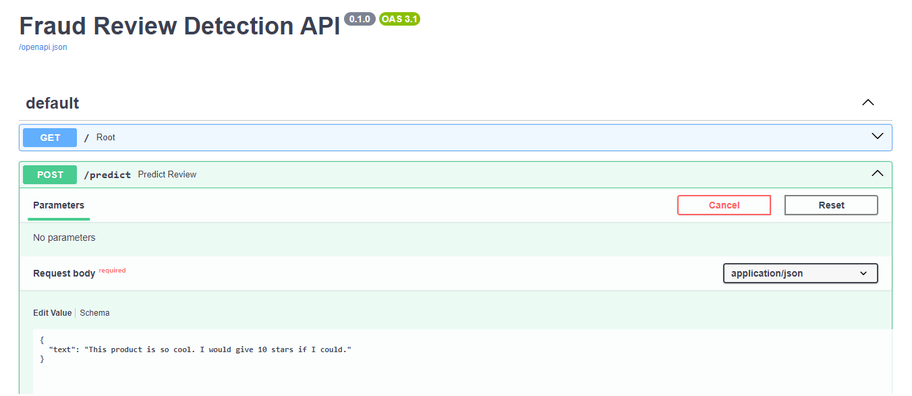

# Fraud Review Detection API

An end-to-end NLP pipeline for detecting potentially fraudulent online reviews using machine learning.

This project demonstrates a production-oriented workflow that includes:
- text preprocessing
- model training
- model evaluation
- prediction on new text
- FastAPI inference service
- Docker containerization

## Project Overview

The goal of this project is to classify online reviews as either:
- **genuine**
- **suspicious**

The repository includes a lightweight sample dataset for reproducibility and quick testing. The same pipeline can be adapted to larger review datasets.


## Technology Stack

- Python
- scikit-learn
- FastAPI
- Docker
- joblib
- pandas
- NumPy

## What is inside?

- Text preprocessing pipeline
- Model training and evaluation
- REST API for predictions
- Docker containerization
- Experiment tracking


## Project Structure

```text
fraud-review-detection-api/
├── api/
│   └── main.py
├── artifacts/
│   └── metrics.json
├── data/
│   ├── processed/
│   │   └── test_data.csv
│   └── sample/
│       └── reviews_sample.csv
├── docs/
├── models/
│   └── .gitkeep
├── notebooks/
│   └── .gitkeep
├── src/
│   ├── evaluate.py
│   ├── predict.py
│   ├── preprocess.py
│   └── train.py
├── tests/
│   └── .gitkeep
├── .dockerignore
├── .gitignore
├── Dockerfile
├── README.md
└── requirements.txt
```

## Train the Model

- python src/train.py

- The trained model will be saved to:

models/model.pkl
models/vectorizer.pkl

## Run the Project

- Train model: python src/train.py

- Evaluate model: python src/evaluate.py

- Predict example: python src/predict.py

## Run the API

Start the FastAPI server:

```bash
uvicorn api.main:app --reload
```

Try interactive docs at(Example):

```bash
http://127.0.0.1:8000/docs
```

## API Documentation




## Run with Docker

Build the image:

```bash
docker build -t fraud-review-api .
```

Run the container:

docker run -p 8000:8000 fraud-review-api

Open the API docs at:

http://127.0.0.1:8000/docs